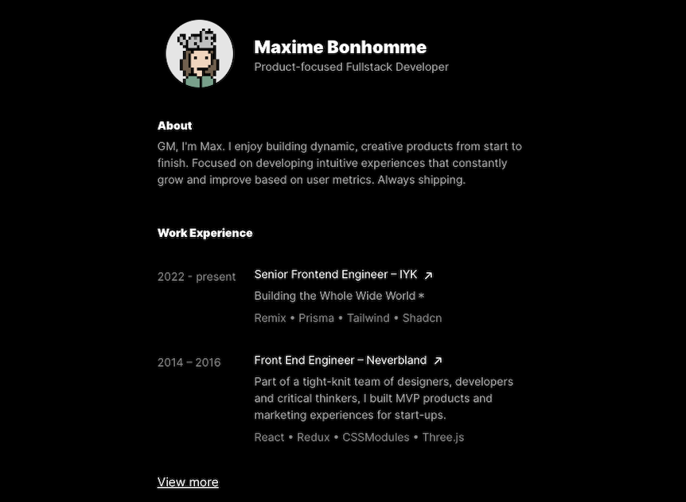
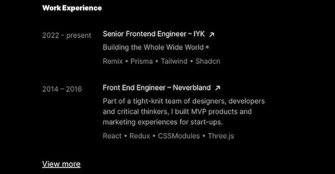

## Tarea: Creación de tu propio portafolio (Parte 1)

### Explicación:
Esta tarea consiste en empezar a crear tu propio portafolio.

Un portafolio para desarrolladores es una colección organizada de proyectos, trabajos y habilidades que un desarrollador ha creado o contribuido. Suele presentarse en forma de sitio web o página personal donde se muestra el trabajo previo del desarrollador, incluyendo proyectos personales, colaborativos y profesionales. Este portafolio no solo exhibe el trabajo realizado, sino que también proporciona información sobre la experiencia, habilidades técnicas, tecnologías utilizadas y enlaces a proyectos relevantes, con el objetivo de destacar las capacidades y logros del desarrollador ante potenciales empleadores, clientes o colaboradores.

### Pasos a seguir:
Para el portafolio te sugerimos usar un diseño cómo el siguiente: 


**Nota:** El diseño propuesto es solo una guía, puedes proponer un diseño mucho mejor.

Tu portafolio debe contar con al menos tres secciones (componentes), descritos a continuación:

1. Componente para información general: Este componente debe renderizar tu foto, nombre y una breve descripción. Para ello te proponemos usar las siguientes propiedades 
    - *picture_url* (string): dirección url de tu foto de perfil.
    - *name* (string): Tu nombre completo, ejemplo: "Juan perez"
    - *description*: Una breve descripcion de tu perfil, ejemplo: "FullStack Developer"

    

2. Componente para renderizar tu perfil: Este componente debe renderizar un texto que servira para mostar tu perfil. Las propiedades de este componente son:
    - *title* (string).
    - *description* (string).

    


2. Componente para renderizar un listado de items: Inicalmentge vamos a usar este componente para renderizar un listado de items que corresponden a tu experiencia laboral. Las propiedades de este componente son:
    - *title* (string). Ejemplo: "Work Experience"
    - *items* (arreglo de objetos). Ejemplo
    ```javascript
    [
        { 
            date: "2022 - present",
            title: "Senior Frontend Eingennier -IYK",
            description: "Building the Whole Wide World﹡",
            languages: "Remix • Prisma • Tailwind • Shadcn".
        },
        { 
            date: "2014 - 2016",
            title: "Front End Engineer – Neverbland",
            description: "Part of a tight-knit team of designers...",
            languages: "React • Redux • CSSModules • Three.js".
        }
    ]
    ```

    
