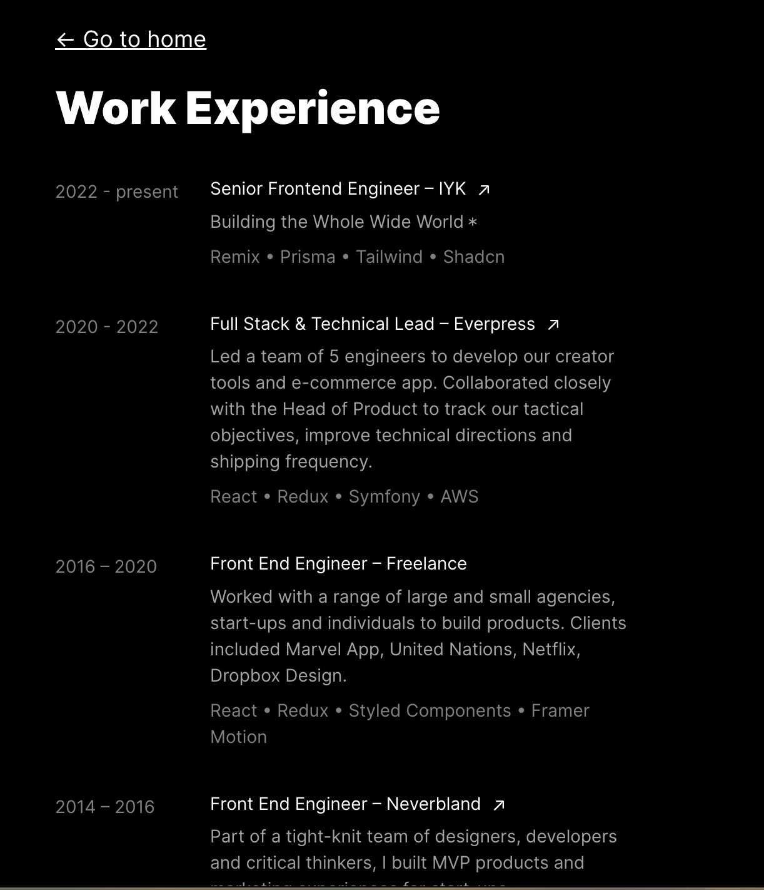

## Tarea: Creación de tu propio portafolio (Parte 2)

### Explicación:
Esta tarea implica la creación de una aplicación de una sola página (SPA) utilizando React Router para gestionar múltiples rutas y mostrar diferentes componentes según la URL. A través de esta tarea, aprenderás a configurar y utilizar React Router para la navegación entre diferentes vistas en una aplicación de React.

### Pasos a seguir:

Vamos a practicar el uso de rutas, para ello vamos a retomar el portafolio que creaste en la clase anterior.

1. Crea una nueva página en tu proyecto llamada WorkExperience, esta página debe mostrar el detalle de toda tu experiencia laboral.



2. Ahora vamos a crear una página llamada NotFound, esta pagina va a servir como la pagina por defecto cuando el usuario consulte una url que no existe en tu proyecto.

.

3. Ahora tu tarea consiste en conectar las rutas de tu pagina de la siguiente forma
    - Debes incuir un botón "Ver más" en el home justo abajo de la experiencia laboral.Este botón debe llevar a el usuario a la pagina WorkExperience creada en el punto 1.
    - Dentro de la página WorkExperience debes incluir un link a el home, ejemplo "← Go to home"
    - Si el usuario digita una URL que no existe llevar a el usuario a la página NotFound, (de manera opcional puedes incluir un botón "Go to home" en está página)

### Importante

Recuerda los siguientes pasos para incluir rutas en tu proyecto

1. Instalación de React Router:

Abre una terminal en el directorio de tu proyecto.
Ejecuta el siguiente comando para instalar React Router:

```npm install react-router-dom```

2. Configuración de las rutas:

Abre el archivo App.js en el directorio src.
Importa los componentes necesarios de React Router:
```javascript
import { BrowserRouter as Router, Route, Routes } from 'react-router-dom';
// Define los componentes que deseas mostrar en diferentes rutas.
// Configura las rutas utilizando el componente Router y Routes:

function App() {
  return (
    <Router>
      <div>
        <Routes>
          <Route path="/" exact element={Home} />
          <Route path="/work-experience" element={WorkExperience} />
          <Route element={NotFound} />
        </Routes>
      </div>
    </Router>
  );
}
```
3. Creación de los componentes para las rutas:

Crea los componentes Home, About, Contact y NotFound en archivos separados dentro del directorio src/components.
Implementa el contenido de cada componente según sea necesario.

4. Navegación entre rutas:

Agrega enlaces (<Link>) en tus componentes para permitir la navegación entre las diferentes rutas.
Utiliza el componente NavLink para estilizar los enlaces activos.

5. Ejecución del proyecto:

Guarda todos los cambios realizados.
Ejecuta el proyecto de React utilizando el comando npm start.
Visita http://localhost:3000 en tu navegador y navega entre las diferentes rutas para verificar el funcionamiento de la aplicación.

Con estos pasos, habrás creado una aplicación de una sola página con múltiples rutas utilizando React Router. Esta tarea te permitirá practicar la configuración y el uso de React Router para la navegación entre diferentes vistas en una aplicación de React.