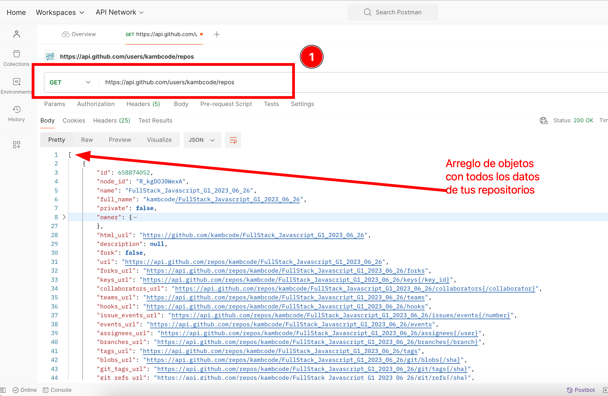
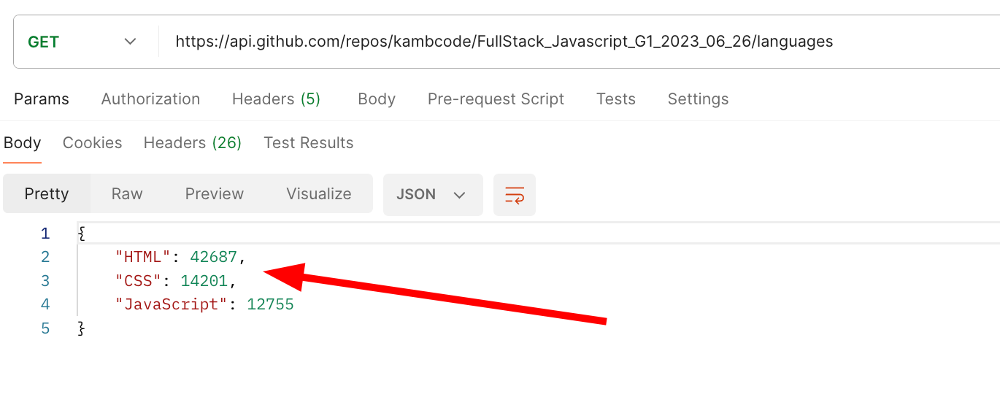

## Tarea: Creación de tu propio portafolio (Parte 3)

### Explicación:
En esta tarea vamos a continuar creando tu portafolio, pero esta vez tu tarea es que la sección que muestra tus proyectos, consulte la información directamenete de la API de github y muestre los proyectos que tienes publicados en Github y que son públicos.

### Pasos a seguir:
Vas a crear un componente, llamado GitProjects (este nombre es solo un ejemplo, tu puedes llamar tu componente como quieras) que se verá de la siguiente forma


**Nota:** El diseño propuesto es solo una guía, puedes proponer un diseño mucho mejor.

1. Las propiedades de este componente son:
    - *title* (string). Ejemplo: "Side Projects"
   
2. Este componente es muy parecido a el componente creado en la tarea anterior "Work Experience", pero la diferencia es que para este componente debes hacer un llamado a la API de GitHub para listar todos los projectos que tienes publicados en tu cuenta de GitHub.

3. Para obtener el listado de proyectos debes hacer una peticion `GET` a esta URL https://api.github.com/users/<GITHUB_USER>/repos (recuerda cambiar el atributo <GITHUB_USER> por tu nombre de usuario), ejemplo https://api.github.com/users/kambcode/repos

Este endpoint te va a retornar un arreglo con los proyectos que tienes publicados en tu cuenta y la información necesaria para generar el componente que estamos creando



Si bien la respuesta de el endpoint tiene mucha información nos vamos a concentrar en los datos que necesitamos para la tarea

- **name** Esta propiedad contiene el nombre de el repositorio
- **description** Esta propiedad contiene la descripción de tu repositorio
- **created_at** Fecha de creación de el proyecto
- **language** este es el lenguaje principal usado en tu proyecto, ejemplo "HTML"

```javascript
    useEffect( () => {
        // Este useeffect se ejecutará una única vez cuando el componente se monte

        fetch("https://api.github.com/users/kambcode/repos")
        .then((response) => response.json()).
        .then((result) => 
            // acá procesamos la respuesta de el endpoint
            console.log(result); // Resultado de el endpoint
        );
    }, [])
```

## Opcional

La propiedad language te retorna el lenguaje principal usado en tu proyecto, pero si realmene quieres saber todos los lenguajes usados en cada proyecto debes usar el atributo **languages_url** que es un string que contiene una URL, eg https://api.github.com/repos/kambcode/FullStack_Javascript_G1_2023_06_26/languages, al hacer una nueva petición GET a esta URL obtendras una respuesta cómo la siguente



Este es un objeto cuyas llaves son los lenguajes usados en tu proyecto, puedes sola mente tomar las llaves de ese objeto haciendo 
```javascript
    const [responseLanguages, setResponseLanguages] = useState([]);
    useEffect( () => {
        fetch("https://api.github.com/repos/kambcode/FullStack_Javascript_G1_2023_06_26/languages")
        .then((response) => response.json()).
        .then((result) => 
            // acá procesamos la respuesta de el endpoint
            const languages = Object.keys(result);
    console.log(languages); // ["HTML", "CSS", "Javascript"]
            setResponseLanguages(languages)
        );
    }, [])
```
